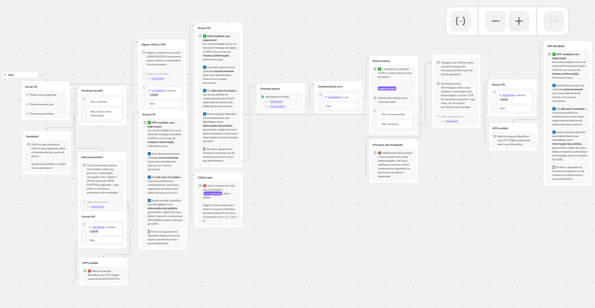

Typebot CEAF – Consulta de Status (Farmácia de Alto Custo)

Este repositório contém o **fluxo completo em JSON de um Typebot** desenvolvido para automatizar o atendimento da **Farmácia de Alto Custo (CEAF)**, permitindo que pacientes consultem o **status do seu processo** utilizando o **CNS** ou **CPF**, com total conformidade com a **LGPD**.

O projeto foi criado com foco em:
- Automação de atendimento público
- Tratar e dar segurança aos dados públicos que serão dispostos aos solicitantes
- Permitir que atenda e se adapte para a realidade de outras unidades ou órgãos
- Compartilhamento e reutilização por outros desenvolvedores

---

## Objetivo do Projeto

Permitir que o cidadão ou representante:
- Localizar o status do seu processo no CEAF via **CNS**
- Tratar os dados e fornecer apenas o status administrativo
- Certificar que seus dados tratados estejam conforme a **Lei Geral de Proteção de Dados (LGPD)**

---

🧩 Visão Geral do Fluxo (Passo a Passo)
O fluxo do bot foi estruturado de forma linear, segura e modular, garantindo clareza para o usuário final e facilidade de manutenção para desenvolvedores. A seguir está o detalhamento completo de cada etapa:

1️⃣ Reset de Segurança (Inicialização da Sessão)
Assim que o bot é iniciado, ele executa um reset completo das variáveis de sessão.
Variáveis limpas:
Nome do paciente
CNS digitado anteriormente
Resposta/status retornado da consulta
Esse passo é fundamental para:
Evitar reutilização indevida de dados
Garantir conformidade com a LGPD
Assegurar que cada conversa seja tratada como uma nova sessão
📌 Este bloco é executado automaticamente antes de qualquer interação com o usuário.

2️⃣ Saudação Inicial e Contextualização
O bot exibe uma mensagem de boas-vindas, apresentando-se como assistente do CEAF.
Informa de forma clara:
Qual serviço está sendo oferecido
Qual unidade está sendo atendida (Farmácia do Gama)
Objetivo:
Criar confiança no usuário
Reduzir dúvidas iniciais
Contextualizar o tipo de informação que pode ser consultada

3️⃣ Menu de Escolha (Decisão do Usuário)
O usuário recebe um menu com duas opções claras:
Verificar status do processo
Solicitar outra informação
Cada opção direciona para um fluxo específico:
Consulta automatizada via CNS
Fluxo alternativo para atendimento humano
Esse ponto funciona como um divisor lógico do fluxo, evitando que usuários avancem sem necessidade.

4️⃣ Coleta do CNS do Paciente
Caso o usuário escolha consultar o status:
O bot solicita o número do CNS, informando explicitamente:
Digitar apenas números
Sem pontos ou espaços
O valor digitado é armazenado na variável:
cns_paciente

5️⃣ Validação Estrutural do CNS
O CNS informado passa por uma validação automática:
Verificação via expressão regular (regex)
Exigência de exatamente 15 dígitos numéricos
Se o valor não atender ao padrão:
O usuário é imediatamente informado do erro
O fluxo é redirecionado para correção
Essa etapa evita:
Consultas inválidas na planilha
Erros de integração
Sobrecarga desnecessária de dados

6️⃣ Confirmação e Aviso de LGPD
Após a validação do CNS:
O bot confirma o recebimento do dado
Exibe um aviso informando que:
Os dados serão usados exclusivamente para atendimento
Não haverá compartilhamento com terceiros
As informações são tratadas como não públicas
Este passo reforça:
Transparência
Segurança jurídica
Conformidade com a LGPD

7️⃣ Consulta Automatizada no Google Sheets
O bot executa uma integração direta com o Google Sheets.
A planilha funciona como base de dados, contendo diversos dados sensíveis relativos ao paciente.
O Paciente entra com um dado sensível pessoal e tem o tratamento dos dados e por fim, recebe o retorno do status administrativo do seu processo sem exposição dos dados sensíveis.

8️⃣ Tratamento do Resultado da Consulta
Após a consulta, o fluxo se divide conforme o resultado:
✅ Registro Encontrado
O bot informa que o cadastro foi localizado
Exibe o status do processo retornado da planilha
Oferece ao usuário duas opções:
Realizar uma nova consulta
Encerrar o atendimento
❌ Registro Não Localizado
O usuário é informado que:
O processo não foi encontrado na base de dados
É orientado a:
Conferir o número informado
Aguardar atendimento humano, se necessário

9️⃣ Fluxos Alternativos e Tratamento de Exceções
O bot possui rotas específicas para situações fora do fluxo principal:
CNS inválido
Erro de formatação ou quantidade de dígitos
Processo inexistente
CNS válido, mas sem registro na planilha
Outras informações
Usuário opta por atendimento humano
Coleta do CPF (sem pontos)
Encaminhamento para um servidor responsável
Esses fluxos garantem que nenhum usuário fique sem resposta, mesmo fora do caminho principal.

🔟 Encerramento da Conversa
O atendimento é finalizado com uma mensagem de agradecimento.
Reforça:
Encerramento seguro da sessão
Boa experiência do usuário
A conversa pode ser reiniciada a qualquer momento, com variáveis limpas.

## 🗂 Estrutura do JSON

O arquivo JSON contém:

- **Eventos**
  - `start`: ponto inicial do bot

- **Groups (Grupos de Blocos)**
  - Reset de variáveis
  - Saudação
  - Menu de escolhas
  - Validação de CNS
  - Termos LGPD
  - Consulta ao Google Sheets
  - Exibição de resultados
  - Fluxos de erro e alternativos
  - Encerramento

- **Variáveis**
  | Variável | Descrição |
  |--------|----------|
  | `cns_paciente` | CNS digitado pelo usuário |
  | `cpf_paciente` | CPF para atendimento humano |
  | `resposta_bot` | Status retornado da planilha |
  | `nome_paciente` | Nome do paciente (opcional) |

---

## 🔐 LGPD e Segurança

O fluxo foi projetado para estar em conformidade com a **LGPD**, incluindo:

- Uso exclusivo dos dados para atendimento
- Dados tratados como **informação não pública** e entregue o status administrativo do processo sem envolver outros dados sensíveis
- Reset automático de variáveis por sessão
- Comunicação clara com o usuário sobre o uso das informações

---

## 🔧 Como Usar

- Faça o download do arquivo JSON disponível neste repositório
- Vá em https://typebot.io/ crie uma conta, caso já tenha acesse o "dashboard"
- Crie um novo bot em "Create a typebot"
- Ao criar um novo bot aparecerá a opção "Import file"
- Nessa opção, ao abrir a janela você irá procurar o arquivo JSON que foi baixado e irá seleciona-lo.
- O fluxo do bot irá aparecer conforme descrito neste projeto e por fim basta integrar o arquivo com o google sheets que será por você utilizado.
  - Esse google sheets está no bloco "Consulta status" selecione "Get data from sheet"
  - Em "select row" mantenha em "all" e adicione um filtro em "+add filter rule"
  - Em "+add filter rule" digite na primeira linha "CNS" ou "CPF" , se for usar o número do CPF, selecione "Equals to" para procurar o valor exato do CNS e atribua a variável "cns_paciente".
